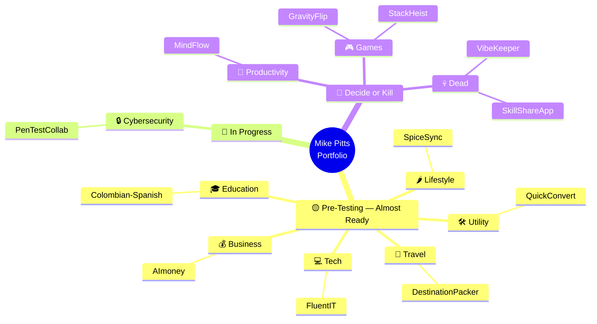
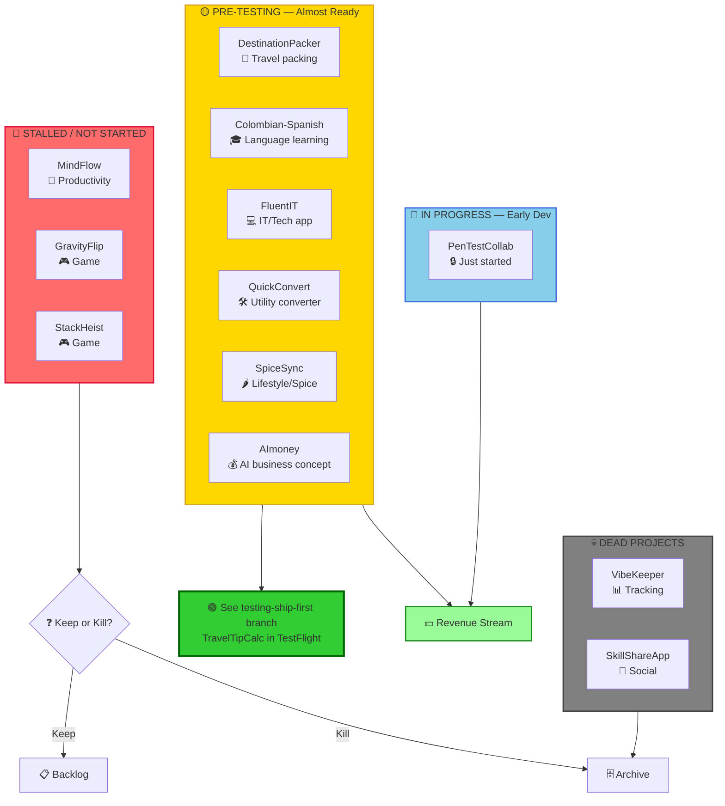
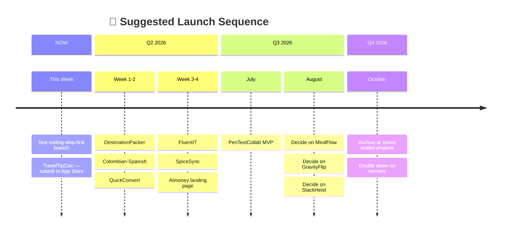
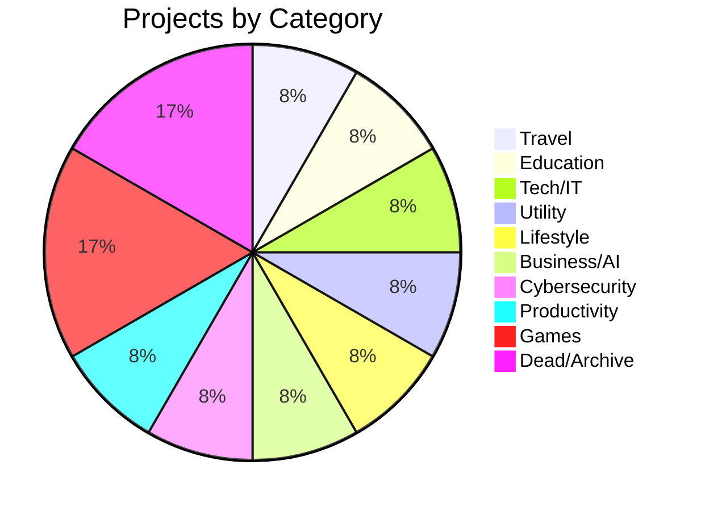
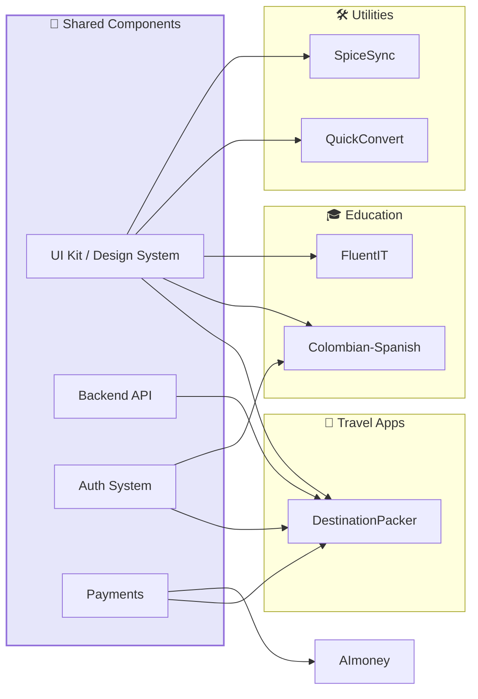

# Mike Pitts — Project Portfolio Visual Tree

## Mindmap View

## Flowchart View — Status & Dependencies

## Timeline View — Suggested Launch Order

## Category Breakdown

## Dependency / Shared Resources Map

